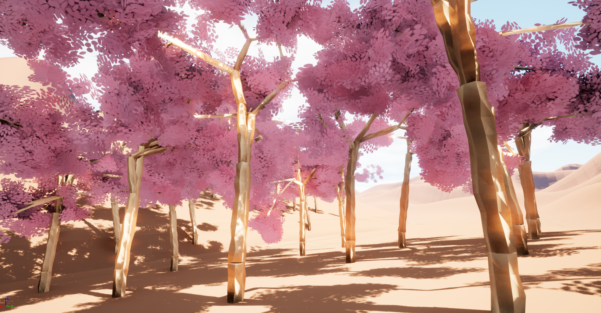

# Forest Simulator Game

Procedurally generated trees using a recursion algorithm, which creates geometry data using a seed for randomness and the UProceduralMeshComponent. 

Note: Due to the GIF format, all media framerates were cut down from 60fps to ~15fps. 

 

## Procedural Terrain Generation

Procedural generated terrain created with a chunk-based loading system, by creating points in a grid and offsetting them vertically by querying a noise function. An algorithm could be implemented to layer several noise functions to create more interesting geometry, however the focus of the project was to create a terrain loading system that was efficient at runtime and minimised major lag-spikes that could hinder the player's experience.

 
 

Algorithm for loading new chunks is based on a querying and queue sytem, run on multiple threads to significantly boost performance and framerate.

 

## LOD

Terrain LOD algorithm that renders furthest chunks at a lower resolution, to optimise framerate and chunk loading. This is done using the same querying and queuing system, except it marks the chunk as needing a re-render - either at a lower or higher resolution to offer more memory and gpu resources for other future aspects of the game.

 

## Tree cutting feature

The tree cutting feature works by using Unreal Engine's in-built procedural mesh slicing functions to seperate a mesh (log) into two separate objects with their own collision. However more action was needed to maintain the structure and physics of the tree after being cut. This was handled through the use of recusion loops and data structures to store each log's information, and an algorithm to maintain the right structure.

 

## Gameplay

Vehicle was not made by me.
