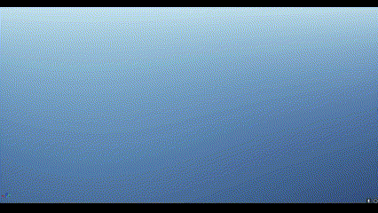

# LumberGame

Procedurally generated trees using a recursion algorithm, which creates geometry data using a seed for randomness and the UProceduralMeshComponent 

#

### Procedural Terrain

Procedural generated terrain created with a chunk-loading based system, by creating points in a grid and offsetting them vertically by querying a noise function.

#

### LOD

Terrain LOD algorithm that renders furthest chunks at a lower resolution, to optimise framerate and chunk loading.
